# Post-Install Process Flowchart

```mermaid
flowchart TD
    A[Start Post-Install Script] --> B{Running as root?}
    B -->|Yes| B1[❌ Exit with error]
    B -->|No| C{Internet connectivity?}
    C -->|No| C1[❌ Exit with error]
    C -->|Yes| D{Previous installation detected?}
    
    D -->|Yes| D1[Show re-run message] --> E[Request user confirmation]
    D -->|No| D2[Show installation message] --> E
    
    E -->|User cancels| E1[❌ Exit gracefully]
    E -->|User confirms| F[System Package Installation]
    
    F --> F1[sudo pacman -S --needed base-devel git curl fish hyprland...]
    F1 --> G[AI System Setup]
    
    G --> G1{ollama command exists?}
    G1 -->|No| G2[Install Ollama] --> G3
    G1 -->|Yes| G3[Pull LLaVA models]
    G3 --> G4{Model available?}
    G4 -->|llava-llama3:8b| H
    G4 -->|Fallback to llava:7b| H
    G4 -->|Any LLaVA model| H
    
    H[System Service Configuration] --> H1{NetworkManager enabled?}
    H1 -->|No| H2[Enable NetworkManager] --> H3
    H1 -->|Yes| H3{NetworkManager active?}
    H3 -->|No| H4[Start NetworkManager] --> I
    H3 -->|Yes| I
    
    I[Shell Configuration] --> I1{fish in /etc/shells?}
    I1 -->|No| I2[Add fish to /etc/shells] --> I3
    I1 -->|Yes| I3{Default shell is fish?}
    I3 -->|No| I4[Change default shell to fish] --> J
    I3 -->|Yes| J
    
    J[Directory Structure Creation] --> J1[Create missing directories only]
    J1 --> K[Dotfiles Installation]
    
    K --> K1[Run symlink-manager.sh] --> K2{Symlinks exist?}
    K2 -->|Missing/Broken| K3[Create/Fix symlinks] --> L
    K2 -->|Valid| L
    
    L[Environment Configuration] --> L1{~/.profile exists?}
    L1 -->|No| L2[Create ~/.profile] --> L3
    L1 -->|Yes| L3[Add missing Wayland variables only]
    L3 --> M
    
    M[Package Management Tools] --> M1{yay installed?}
    M1 -->|No| M2[Build and install yay] --> M3
    M1 -->|Yes| M3{pacui installed?}
    M3 -->|No| M4[Clone and install pacui] --> N
    M3 -->|Yes| N
    
    N[Final Setup] --> N1{Theme exists?}
    N1 -->|No| N2[Generate initial theme] --> N3
    N1 -->|Yes| N3{Git configured?}
    N3 -->|No| N4[Configure Git] --> O
    N3 -->|Yes| O
    
    O[✅ Installation Complete] --> P[Show completion message]
    
    style A fill:#e1f5fe
    style O fill:#c8e6c9
    style B1 fill:#ffcdd2
    style C1 fill:#ffcdd2
    style E1 fill:#ffcdd2
    style P fill:#c8e6c9
```

## Flow Explanation

### **Safety Checks (Start)**
- Prevents root execution for security
- Verifies internet connectivity for downloads
- Detects previous installations for smart handling

### **User Interaction**
- Different messages for first-time vs re-run scenarios
- Always requires user confirmation before proceeding
- Graceful exit if user cancels

### **System Installation**
- Uses `--needed` flag to skip already installed packages
- Handles all essential packages in single operation
- Automatic dependency resolution

### **AI System Setup**
- Smart detection of existing Ollama installation
- Model fallback strategy (llava-llama3:8b → llava:7b → any LLaVA)
- Only downloads models if missing

### **Service Management**
- Checks service state before modifications
- Only enables/starts services that need configuration
- Preserves existing working configurations

### **Shell Configuration**
- Validates fish shell availability
- Only modifies shell configuration if needed
- Preserves user preferences

### **File Operations**
- Creates only missing directories
- Validates existing symlinks before modifying
- Granular control over file operations

### **Environment Setup**
- Preserves existing environment variables
- Adds only missing Wayland configurations
- Smart ~/.profile management

### **Tool Installation**
- Builds from source only if tools missing
- Handles build failures gracefully
- Installs essential AUR packages

### **Finalization**
- Respects existing themes and configurations
- Only configures unconfigured components
- Provides clear completion feedback

This flowchart illustrates the script's **idempotent** nature - it can be run multiple times safely, only performing necessary operations while preserving existing configurations. 