# Dynamic Theming System Flowchart

```mermaid
flowchart TD
    A[🎨 Theme Trigger] --> B{Trigger Type}
    
    B -->|Super+W| C[Interactive Wallpaper Picker]
    B -->|Super+Shift+W| D[Random Wallpaper Selection]
    B -->|Manual Command| E[wallpaper-picker command]
    
    C --> F[Scan ~/Pictures/Wallpapers/]
    D --> F
    E --> F
    
    F --> G{Wallpapers found?}
    G -->|No| G1[❌ Create directory & show warning] --> Z[End]
    G -->|Yes| H[Generate thumbnails for new images]
    
    H --> I[Launch fuzzel with thumbnail grid]
    I --> J{User selection}
    J -->|Cancel| Z
    J -->|Select wallpaper| K[Set wallpaper via swww]
    
    K --> L[🧠 Color Extraction Phase]
    
    L --> M[Generate image hash for caching]
    M --> N{Cache hit?}
    N -->|Yes| N1[Load cached palette] --> R
    N -->|No| O[AI Analysis Required]
    
    O --> P{Ollama connection?}
    P -->|Failed| P1[❌ Use fallback colors] --> R
    P -->|Success| Q[LLaVA Model Selection]
    
    Q --> Q1{Model Priority}
    Q1 -->|1st| Q2[llava-llama3:8b] --> S
    Q1 -->|2nd| Q3[llava:7b] --> S
    Q1 -->|3rd| Q4[Any available LLaVA] --> S
    Q1 -->|None| Q5[❌ Use fallback colors] --> R
    
    S[🎨 AI Palette Analysis] --> T[Encode image to base64]
    T --> U[Send structured MaterialYou prompt]
    U --> V{Valid JSON response?}
    V -->|No| V1[Retry up to 3 times] --> V2{Retry successful?}
    V2 -->|No| V3[❌ Use fallback colors] --> R
    V2 -->|Yes| W
    V -->|Yes| W[Parse and validate colors]
    
    W --> X[Cache analysis results] --> R
    
    R[🎨 Color Processing & Enhancement] --> R1[Expand base palette]
    R1 --> R2[Generate MaterialYou color scheme]
    R2 --> R3[Apply color harmony functions]
    R3 --> R4[Validate all hex colors]
    R4 --> Y[🔄 Template Rendering Phase]
    
    Y --> Y1[Scan templates/ directory]
    Y1 --> Y2[Find all *.template files]
    Y2 --> Y3[Process variable substitution]
    Y3 --> Y4[Apply color functions]
    Y4 --> Y5[Validate output formats]
    Y5 --> AA[⚡ Atomic Application Phase]
    
    AA --> AA1[Create timestamped backup]
    AA1 --> AA2[Deploy all configs simultaneously]
    AA2 --> AA3[Update symlinks atomically]
    AA3 --> BB[🔄 Service Reloading]
    
    BB --> BB1[Hyprland: hyprctl reload]
    BB --> BB2[Waybar: restart process]
    BB --> BB3[Dunst: restart process]
    BB --> BB4[Terminals: signal reload]
    BB --> BB5[GTK: theme detection]
    
    BB1 --> CC[✅ Theme Applied Successfully]
    BB2 --> CC
    BB3 --> CC
    BB4 --> CC
    BB5 --> CC
    
    CC --> DD[Show success notification]
    DD --> Z
    
    %% Error Recovery Paths
    AA1 -->|Backup fails| EE[❌ Critical failure - rollback]
    AA2 -->|Deployment fails| FF[❌ Partial failure - continue]
    BB1 -->|Service fails| GG[❌ Restart service]
    BB2 -->|Service fails| GG
    BB3 -->|Service fails| GG
    
    EE --> HH[Restore from backup] --> Z
    FF --> CC
    GG --> CC
    
    %% Styling
    style A fill:#e1f5fe
    style CC fill:#c8e6c9
    style DD fill:#c8e6c9
    style Z fill:#f3e5f5
    style G1 fill:#ffcdd2
    style P1 fill:#fff3e0
    style Q5 fill:#fff3e0
    style V3 fill:#fff3e0
    style EE fill:#ffcdd2
    style FF fill:#fff3e0
    style GG fill:#fff3e0
```

## Detailed Phase Breakdown

### **🎨 Wallpaper Selection Phase**

**Key Features:**
- Automatic thumbnail generation with caching
- Support for PNG, JPEG, WebP formats
- Graceful handling of missing wallpapers
- Rofi fallback if fuzzel unavailable

### **🧠 AI Color Extraction Phase**

**AI Integration:**
- Local LLaVA model processing
- Structured JSON prompts for consistent results
- Hash-based caching for performance
- Multi-model fallback strategy

### **🎨 Color Processing Phase**

**Color Science:**
- 16-color MaterialYou palette expansion
- Mathematical color harmony functions
- WCAG accessibility compliance
- RGB/HSL/LAB color space support

### **🔄 Template Rendering Phase**

**Template System:**
- Minimal templates (colors only)
- Advanced color manipulation functions
- Application-specific formatting
- DRY principle implementation

### **⚡ Atomic Application Phase**

**Safety Features:**
- Timestamped backups with 7-day retention
- Atomic deployment (all or nothing)
- Parallel service reloading
- Automatic rollback on critical failures

## Supported Applications

| Application | Method | Config Location |
|-------------|--------|----------------|
| **Hyprland** | `hyprctl reload` | `~/.config/hypr/` |
| **Waybar** | Process restart | `~/.config/waybar/` |
| **Terminals** | Signal reload | `~/.config/kitty/`, `~/.config/foot/` |
| **Fish Shell** | Theme sourcing | `~/.config/fish/` |
| **Dunst** | Process restart | `~/.config/dunst/` |
| **Fuzzel** | Config reload | `~/.config/fuzzel/` |
| **GTK** | Theme detection | `~/.config/gtk-*/` |
| **btop** | Config reload | `~/.config/btop/` |

## Performance Optimizations

- **Caching**: Image analysis, thumbnails, templates, colors
- **Parallel Processing**: Template rendering, service reloading
- **Resource Management**: Memory optimization, CPU balancing
- **Smart Updates**: Only process changed components

This system provides **real-time AI-powered theming** with **atomic updates** and **comprehensive error recovery**, ensuring a smooth and reliable user experience while maintaining visual consistency across all desktop applications. 